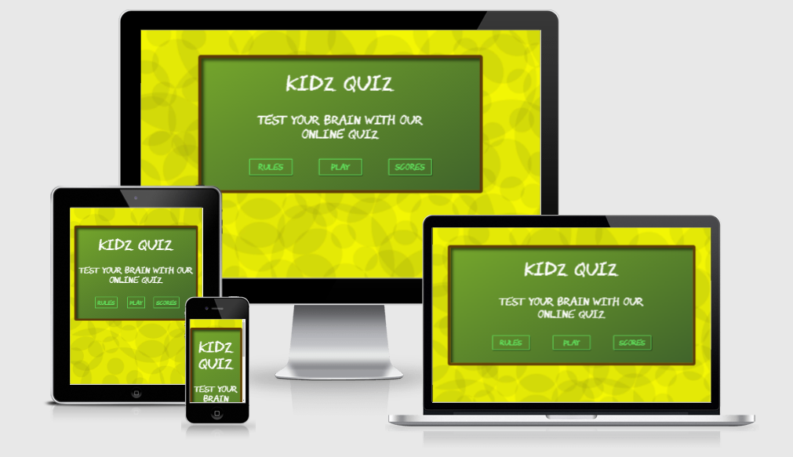
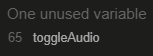
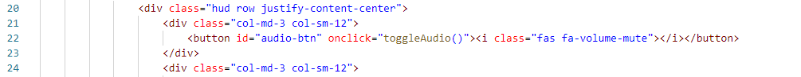
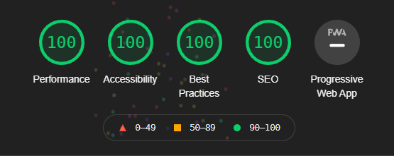
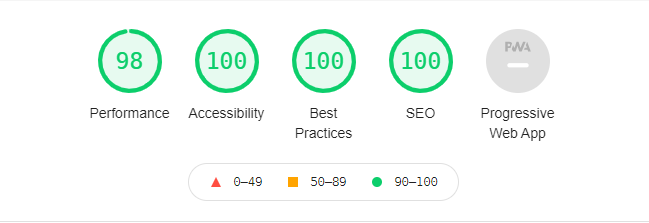
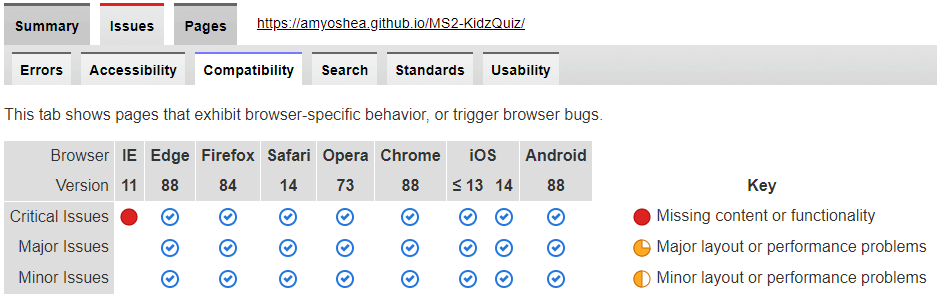

# Kidz Quiz
Kidz Quiz is an interactive website designed for children to test their knowledge. With COVID-19 meaning schools are shut, parents are having to find fun and interactive ways to teach their children while at home. A great way to do this is through game play. 

At this point in development, this will be aimed at children aged 7-8 yrs old and the questions will consist of Math, English, Geography, Science, Animals and General Knowledge. 

You can find the live site [here](https://amyoshea.github.io/MS2-KidzQuiz/).


# Contents
+ [User Experience](#user-experience-(ux))
  + [User Stories](#user-stories)
  + [Design](#design)
    + [Overall Feel](#overall-feel)
    + [Colour Scheme](#colour-scheme)
    + [Typography](#typography)
    + [Sound](#sound)
  + [Wireframes and Initial Design](#wireframes-and-initial-design)
    + [Wireframes](#wireframes)
    + [Design Mock Up](#design-mock-up)
+ [Features](#features)
  + [Current Features](#current-features)
  + [Possible Future Features](#possible-future-features)
+ [Technologies Used](#technologies-used)
  + [Languages Used](#languages-used)
  + [Frameworks Libraries & Programmes Used](#frameworks-libraries-and-programmes-used)
+ [Testing](#testing)
  + [Validator Testing](#validator-testing) 
  + [Lighthouse Testing](#lighthouse-testing)
  + [PowerMapper Compatibility](#powerMapper-compatibility)
  + [Other Testing](#other-testing)
+ [Deployment](#deployment)
  + [Deployment through GitHub Pages](#deployment-through-gitHub-pages)
  + [Cloning Project](#cloning-project)
+ [Credits](#credits)
  + [Content](#content)
  + [Media](#media)
  + [Acknowledgements](#acknowledgements)
---
---
# User Experience (UX)
## User Stories
#### As a child user: 
+ I want to be able to easily navigate through the site.
+ I want to choose if I want sound to play. 
+ I want to be able to see my score as the game progresses.
+ I want to know how many questions I have already answered during the game. 
+ I want to compare my scores to other users. 
+ I want to easily replay the game once I have completed a game. 
+ I want to be able to come back to the game after a period of time and still access my old scores. 
#### As a parent: 
+ I want my child to be able to test their knowledge.
+ I want the site to be easy to navigate through so that my child does not require assistance with the UI. 
+ I want a variety of subjects covered so that I can identify any gaps in my child's knowledge. 
## Design
### Overall Feel
The overall feel of this website is to emulate and old school classroom setting. While this setting could be seen as outdated due to the fact that classrooms don't use greenboards or chalk any more, I believe that the imagery is instantly recognisable. 
### Colour Scheme
I'm sticking to a simple colour pallette to cause little to no distraction for a child to be able to focus. 
### Typography
To go with the school theme, I wanted a typeface that would emulate the look of chalk on a board.
I chose the [Chawp](https://www.1001fonts.com/chawp-font.html) font created by [Tyler Finck](https://www.1001fonts.com/users/tylerfinck/) because it was open source and it fit the school theme. I was then able to convert the .tff file to both .woff and .woff2 files for cross browser compatibility.
### Sound
The plan for sound was to keep it as simple as possible - as with the colour scheme, I want to keep the possible distractions to a minimum doe to the young age of the target audience. The only sound is based on the user getting an answer right or wrong. 
## Wireframes and Initial Design
### Wireframes
All Wireframes were designed for laptop/computer, iPad/tablet and phone display.
+ **Homepage** wireframes [here](https://github.com/AmyOShea/MS2-KidzQuiz/blob/master/assets/images/README/01-Home.png)
+ **Rules** wireframes [here](https://github.com/AmyOShea/MS2-KidzQuiz/blob/master/assets/images/README/02%20-%20Rules.png)
+ **Game Play** wireframes [here](https://github.com/AmyOShea/MS2-KidzQuiz/blob/master/assets/images/README/03%20-%20Game%20Play.png)
+ **End Game** wireframes [here](https://github.com/AmyOShea/MS2-KidzQuiz/blob/master/assets/images/README/04%20-%20EndGame.png)
+ **Top Scores** wireframes [here](https://github.com/AmyOShea/MS2-KidzQuiz/blob/master/assets/images/README/05%20-%20Scores.png)
### Design Mock Up
+ **Homepage** design [here](https://github.com/AmyOShea/MS2-KidzQuiz/blob/master/assets/images/README/Mock%20-%2001%20Home.PNG)
+ **Rules** design [here](https://github.com/AmyOShea/MS2-KidzQuiz/blob/master/assets/images/README/Mock%20-%2002%20Rules.PNG)
+ **Game Play** design [here](https://github.com/AmyOShea/MS2-KidzQuiz/blob/master/assets/images/README/Mock%20-%2003%20Game.PNG)
+ **End Game** design [here](https://github.com/AmyOShea/MS2-KidzQuiz/blob/master/assets/images/README/Mock%20-%2004%20End%20Game.PNG)
+ **Top Scores** design [here](https://github.com/AmyOShea/MS2-KidzQuiz/blob/master/assets/images/README/Mock%20-%2005%20Scores.PNG)
---
---
# Features
## Current Features
+ All pages fully reponsive on all screen sizes.
+ Fully functioning navigation links on all pages for ease of access through site.
+ Optional audio played through game. 
+ Randomised, age-appropriate questions covering a range of subjects.
+ Continuous score updates as the game progresses. 
+ Continuous question number updates as the game progresses. 
+ Ability to enter name at the end of the game to add to a local leader board.
+ Local leader board accessible after site is closed and reopened.
## Possible Future Features
+ This site could be expanded include different questions based on age.
+ There could be an option to choose a specific subject to test knowledge on rather than a random selection. 
+ Global leaderboard rather than local. 
---
---
# Technologies Used
## Languages Used
+ [HTML5](https://en.wikipedia.org/wiki/HTML5)
+ [CSS3](https://en.wikipedia.org/wiki/CSS)
+ [JavaScript](https://en.wikipedia.org/wiki/JavaScript)
## Frameworks Libraries and Programmes Used
+ [Adobe Photoshop](https://www.adobe.com/ie/products/photoshop.html) user to design initial mock ups, green board image and site background. 
+ [Bootstrap](https://getbootstrap.com/) used for responsive design.
+ [Font Awesome](https://fontawesome.com/) used for icons.
+ [GitHub](https://github.com/) used to host repository.
+ [GitPod](https://www.gitpod.io/) used to develop project and organise version control.
+ [GitHub Pages](https://pages.github.com/) Pages used to deploy the site.
+ [Balsamiq](https://balsamiq.com/) used to create wireframes.
+ [Autoprefixer]("https://autoprefixer.github.io/") used to make CSS cross-browser compatible.
+ [Transfonter](https://transfonter.org/) used to convert font from .tff to .woff and .woff2.
+ [iOS Garage Band](https://apps.apple.com/ie/app/garageband/id408709785) used to create audio.
+ [Lighthouse](https://developers.google.com/web/tools/lighthouse) for performance review.
+ [PowerMapper](https://www.powermapper.com/) used to check compatibility with older browsers.
+ [Responsinator](https://www.responsinator.com/) used to check site was responsive on different screen sizes.
---
---
# Testing
## Validator Testing
At the completion or heavy editing of sections, I used the following to check my code for syntax errors:
+ [HTML](https://validator.w3.org/) 
  + All pages came back with no errors.
+ [CSS](https://jigsaw.w3.org/css-validator/)
  + CSS came back with no errors. 
  + CSS did display warnings but they're all in relation to vendor prefixes. 
+ [JavaScript](https://jshint.com/)

  + The only issue coming back from JS Validator is an unused function: 

    
  + However, this function is called in game.html:  

    
## Lighthouse Testing
I used Chromes Lighthouse tools to test site performance. I made sure to check both desktop and mobile performances. Below are the screenshots from both tests:
### Lighthouse Desktop

### Lighthouse Mobile


Even though it's not a perfect score on mobile, I'm very happy with the outcome. There's a slight reduction in the 'Performance' score but this seems fractional in the grand scheme of the project. 
## PowerMapper Compatibility
I used the PowerMapper Compatibility feature to test the site on browsers that I don't have access to. 



Internet Explorer was the big fail on this test. 
The issue comes from using a WebP images as the background and this file type is not supported on IE. However, this is the optimal file type for all other browsers. And as IE has basically been deemed obsolete, I'm going to continue using the WebP image. As a concession, I have added a background colour to the page to emulate the look of the site (it's probably best practice to have a backup colour in place just in case the image doesn't load).
## Other Testing
Due to the size of the testing section, I have created a separate document for it. You can find  it [here](https://github.com/AmyOShea/MS2-KidzQuiz/blob/master/testing.md). 

---
---
# Deployment
## Deployment through GitHub Pages
This site was deployed through GitHub Pages using the following steps:
+ Log into GitHub.
+ Locate the repository.
+ Locate the settings option along the options bar.
+ Locate GitHub Pages options towards the bottom of the page.
+ In 'Source' dropdown, select 'Master' from the branch options.
+ Click the save button.
+ The site is now published though it may not be accessible straight away.
+ The site URL will be visible on the green bar under the section header. This will remain there permanently and you can refer back to it at any time.
## Forking the Repository
+ Log in to GitHub and locate the GitHub Repository
+ At the top of the Repository just above the "Settings" Button on the menu, locate the "Fork" Button.
+ You will have a copy of the original repository in your GitHub account.
+ You will now be able to make changes to the new version and keep the original safe. 
## Making a Local Clone
+ Log into GitHub.
+ Locate the repository.
+ Click the 'Code' dropdown above the file list.
+ Copy the URL for the repository.
+ Open Git Bash on your device.
+ Change the current working directory to the location where you want the cloned directory.
+ Type ```git clone``` in the CLI and then paste the URL you copied earlier. This is what it should look like:
  + ```$ git clone https://github.com/AmyOShea/MS2-KidzQuiz.git```
+ Press Enter to create your local clone.
---
---
# Credits
## Code
+ The techniques I learned in [James Q Quick's tutorial](https://youtube.com/playlist?list=PLDlWc9AfQBfZIkdVaOQXi1tizJeNJipEx) was invaluable in creating the game functionality.
+ Likewise, for adding sound I found [Cukmekerb's Coding Class tutorial](https://www.youtube.com/watch?v=p4OHVJxd2FI&t=149s) very helpful in learning basic Javascript Audio basics that I could incorperate into my own project. 
+ [W3Schools](https://www.w3schools.com/) helped develop a better understanding of [arrow functions](https://www.w3schools.com/js/js_arrow_function.asp) and the [fetch method](https://www.w3schools.com/js/js_api_fetch.asp).
+ [MDN Web Docs](https://developer.mozilla.org/en-US/) helped develop a better understanding of [JSON parse](https://developer.mozilla.org/en-US/docs/Web/JavaScript/Reference/Global_Objects/JSON/parse) and [local storage](https://developer.mozilla.org/en-US/docs/Web/API/Window/localStorage).
## Content
Two resources were used to compile most of the questions:
+ [IXL Personalised Learning](https://ie.ixl.com/).
+ [The Irish Mirror Online Quiz](https://www.irishmirror.ie/news/irish-news/70-kids-general-knowledge-quiz-23382217).
All other questions and content were written by Amy O'Shea (website creator).
## Media
+ All images have been created by Amy O'Shea (website creator).
+ All sounds have been created by Amy O'Shea (website creator).
## Acknowledgements
+ A massive shoutout to my cousins and their children for being testers that hit the target audience age. 
+ To all of my friends who tested the game in it's earliest stages and sent me all issues that they came across, that help was invaluable. 
+ A big thank you to the Slack Community for their endless support and having most of my questions answered before I even knew I had them! And a special mention to [Simen Daehlin](https://app.slack.com/client/T0L30B202/CGWQJQKC5/user_profile/U4MVA9YQP) who I think has answered just about every question that has come up on there!
+ And my mentor Antonio Rodriguez for going through the project step by step and teaching me how to approach what seemed like a behemoth task. 