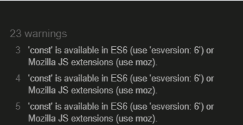
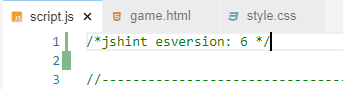
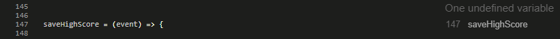
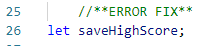
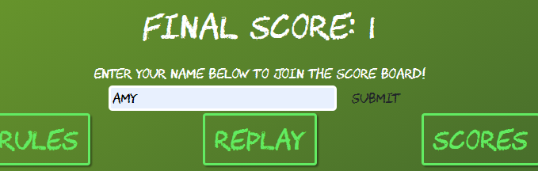

# Kidz Quiz

Kidz Quiz is an interactive website designed for children to test their knowledge. With COVID-19 meaning schools are shut, parents are having to find fun and interactive ways to teach their children while at home. A great way to do this is through game play. 

At this point in development, this will be aimed at children aged 7-8 yrs old and the questions will consist of Math, English, Geography, Science, Animals and General Knowledge. 

You can find the live site [here](https://amyoshea.github.io/MS2-KidzQuiz/).

# User Experience

## User Stories

#### As a child user: 
+ I want to be able to easily navigate through the site.
+ I want to be able to play a fully functioning game.
+ I want to be able to see my score as the game progresses.
+ I want to know how many questions I have already answered during the game. 
+ I want to compare my scores to other users. 
+ I want to easily replay the game once I have completed a round. 
+ I want to know if I have answered a question correctly straight away. 
+ I want to know the right answer if I get a question wrong. 
#### As a parent: 
+ I want my child to be able to test their knowledge.
+ I want my child to learn some new information. 
+ I want the site to be easy to navigate through so that my child does not require assistance with the UI. 
+ I want a variety of subjects covered so that I can identify any gaps in my child's knowledge. 

## Design
### Overall Feel
The overall feel of this website is to emulate and old school classroom setting. While this setting could be seen as outdated due to the fact that classrooms don't use greenboards or chalk any more, I believe that the imagery is instantly recognisable. 
### Colour Scheme
I'm sticking to a simple colour pallete to cause little to no distraction for a child to be able to focus. 
### Typography
To go with the school theme, I wanted a typface that would emulate the look of chalk on a board.
I chose the [Chawp](https://www.1001fonts.com/chawp-font.html) font created by [Tyler Finck](https://www.1001fonts.com/users/tylerfinck/) becuse it was open source and it fit the school theme. I was then able to convert the .tff file to both .woff and .woff2 files for cross browser compatibility.
## Wireframes & Design
### Wireframes
All Wireframes were designed for laptop/computer, iPad/tablet and phone display.
+ **Homepage** wireframes [here](https://github.com/AmyOShea/MS2-KidzQuiz/blob/master/assets/images/README/01-Home.png)
+ **Rules** wireframes [here](https://github.com/AmyOShea/MS2-KidzQuiz/blob/master/assets/images/README/02%20-%20Rules.png)
+ **Game Play** wireframes [here](https://github.com/AmyOShea/MS2-KidzQuiz/blob/master/assets/images/README/03%20-%20Game%20Play.png)
+ **End Game** wireframes [here](https://github.com/AmyOShea/MS2-KidzQuiz/blob/master/assets/images/README/04%20-%20EndGame.png)
+ **Top Scores** wireframes [here](https://github.com/AmyOShea/MS2-KidzQuiz/blob/master/assets/images/README/05%20-%20Scores.png)

### Design Mock Up
+ **Homepage** design [here](https://github.com/AmyOShea/MS2-KidzQuiz/blob/master/assets/images/README/Mock%20-%2001%20Home.PNG)
+ **Rules** design [here](https://github.com/AmyOShea/MS2-KidzQuiz/blob/master/assets/images/README/Mock%20-%2002%20Rules.PNG)
+ **Game Play** design [here](https://github.com/AmyOShea/MS2-KidzQuiz/blob/master/assets/images/README/Mock%20-%2003%20Game.PNG)
+ **End Game** design [here](https://github.com/AmyOShea/MS2-KidzQuiz/blob/master/assets/images/README/Mock%20-%2004%20End%20Game.PNG)
+ **Top Scores** design [here](https://github.com/AmyOShea/MS2-KidzQuiz/blob/master/assets/images/README/Mock%20-%2005%20Scores.PNG)

# Features
## Current Features
+ Randomised, age-appropriate questions covering a range of subjects.
+ Continuous score updates as the game progresses. 
+ Ability to enter name at the end of the game to add to a local leader board.
## Possible Future Features
+ This site could be expanded include different questions based on age.
+ There could be an option to schoose a specific subject to test knowledge on rather than a random selection. 
+ Global leaderboard rather than local. 
# Technologies Used
## Languages Used
+ [HTML5](https://en.wikipedia.org/wiki/HTML5)
+ [CSS3](https://en.wikipedia.org/wiki/CSS)
+ [JavaScript](https://en.wikipedia.org/wiki/JavaScript)
## Frameworks, Libraries & Programmes Used
+ [Adobe Photoshop](https://www.adobe.com/ie/products/photoshop.html) user to design initial mock ups, green board image and site background. 
+ [Bootstrap](https://getbootstrap.com/) used for responsive design.
+ [Font Awesome](https://fontawesome.com/) used for icons.
+ [Google Fonts](https://fonts.google.com/) used to import fonts.
+ [GitHub](https://github.com/) used to host repository.
+ [GitPod](https://www.gitpod.io/) used to develop project and orgainse version control.
+ [GitHub](https://pages.github.com/) Pages used to deploy the site.
+ [Balsamiq](https://balsamiq.com/) used to create wireframes.
+ [Transfonter](https://transfonter.org/) used to convert font from .tff to .woff and .woff2.
+ [Lighthouse](https://developers.google.com/web/tools/lighthouse) for performance review.
+ [PowerMapper](https://www.powermapper.com/) used to check compatibility with older browsers.
+ [Responsinator](https://www.responsinator.com/) used to check site was responsive on different screen sizes.
# Testing
## Validator Testing
At the completion or heavy editing of sections, I used the following to check my code for syntax errors:
+ [HTML](https://validator.w3.org/) 
+ [CSS](https://jigsaw.w3.org/css-validator/)
+ [JavaScript](https://jshint.com/)

## Testing User Stories from (UX) Section

## Bugs & Fixes
1. After the first run through the JS Validator, I recieved the following error: 

  

  After a bit of research I learned that if you declare that you're using ES6 at the top of your JavaScript file, this error will be removed. I added the following line at the top of my JavaScript file:  

---
2. Initially I wanted the JavaScript to all be on one page. However, because there were seperate HTML pages that were being used, there were elements that JS was trying to access that didn't exist on certain pages: 

As a result, I seperated the JavaScript into seperate files.

However, after a bit of research, I learned that I could use an 'if statement' to decide if that element existed and, if not, ignore the JavaScript function. 

---

3. Afer another run through the JS validator, I recieved the following error: 

I tried a few fixes (including declaring it as a vairable on that line) but each fix seemed to cause more problems. As a solution, I added saveHighScores to my variables section but didn't give it any value: 

  

---

## Known Bugs
+ When the user is given the option to input their name to the leaderboard, the auto fill feature is createing a styling issue. When a user manually types their name into the input area, the styling remains consistant with the rest of the page. However, when an auto fill option is clicked, the styling changes (as below):

I've tried to find a fix for this but according to [Mozilla](https://developer.mozilla.org/en-US/docs/Web/CSS/:autofill), there are set stylings that are incredibly difficult to override. I'm happy enough to let this go as, in the grand scheme of the project, it is not a huge deal. 

# Deployment

## Deployment through GitHub Pages
This site was deployed through GitHub Pages using the following steps:

+ Log into GitHub.
+ Locate the repository.
+ Locate the settings option along the options bar.
+ Locate GitHub Pages options towards the bottom of the page.
+ In 'Source' dropdown, select 'Master' from the branch options.
+ Click the save button.
+ The site is now published though it may not be accesible straight away.
+ The site URL will be visable on the green bar under the section header. This will remain there permanently and you can refer back to it at any time.

## Cloning Project

+ Log into GitHub.
+ Locate the repository.
+ Click the 'Code' dropdown above the file list.
+ Copy the URL for the repository.
+ Open Git Bash on your device.
+ Change the current working directory to the location where you want the cloned directory.
+ Type git clone in the CLI and then paste the URL you copied earlier. This is what it should look like:
  + $ git clone https://github.com/AmyOShea/MS2-KidzQuiz.git
+ Press Enter to create your local clone.

# Credits
## Content
Two resources were used to compile most of the questions:
+ [IXL Personalised Learning](https://ie.ixl.com/).
+ [The Irish Mirror Online Quiz](https://www.irishmirror.ie/news/irish-news/70-kids-general-knowledge-quiz-23382217).
All other questions and content were written by Amy O'Shea (website creator).
## Media
All images have been created by Amy O'Shea (website creator).
