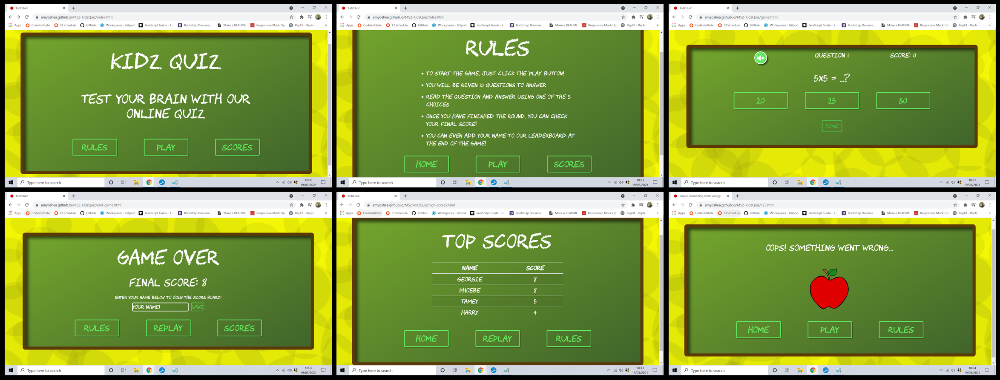
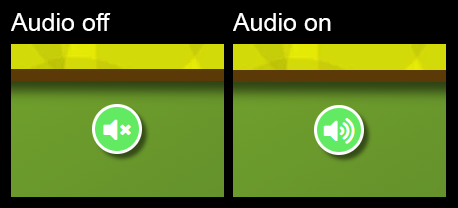
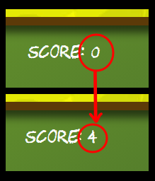
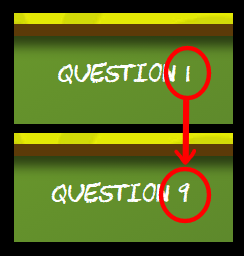
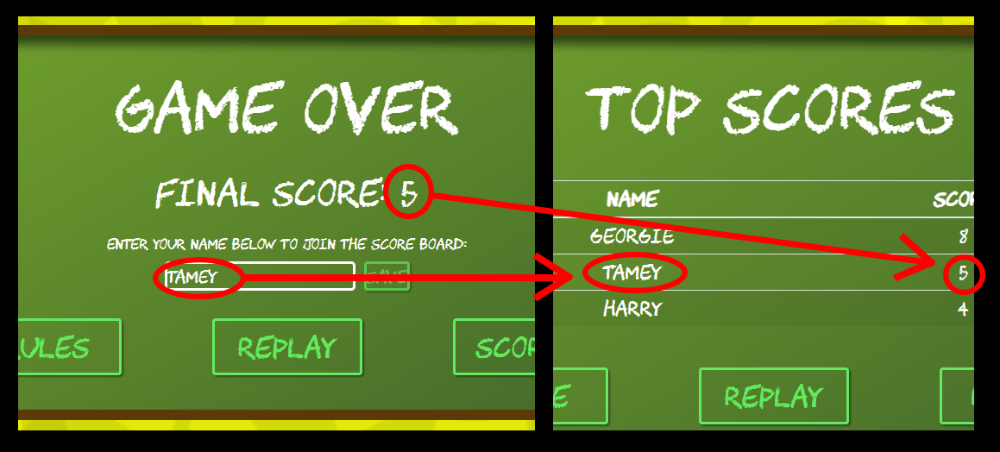
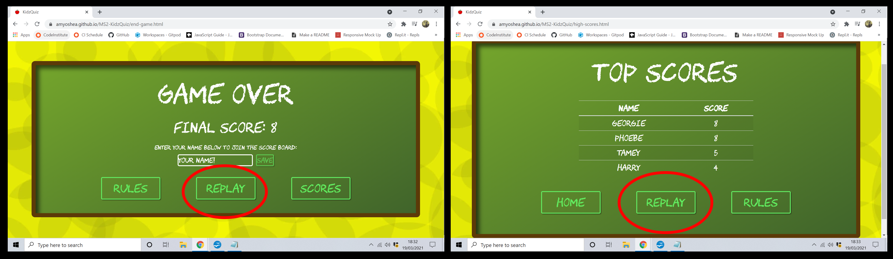
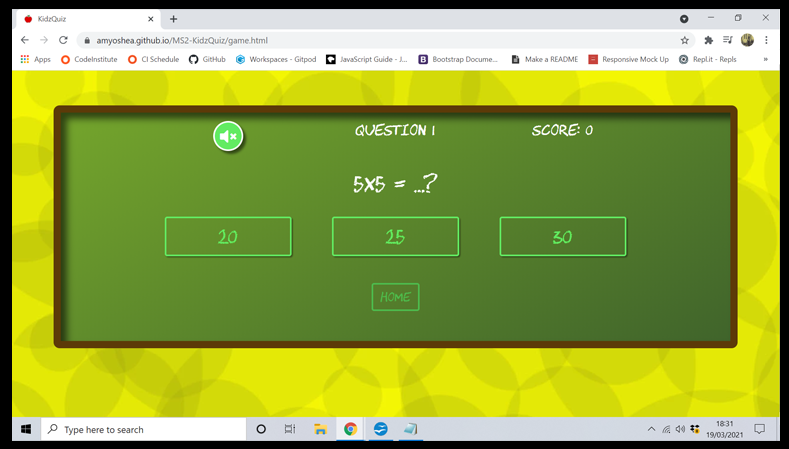
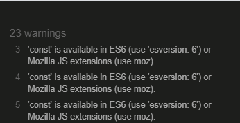
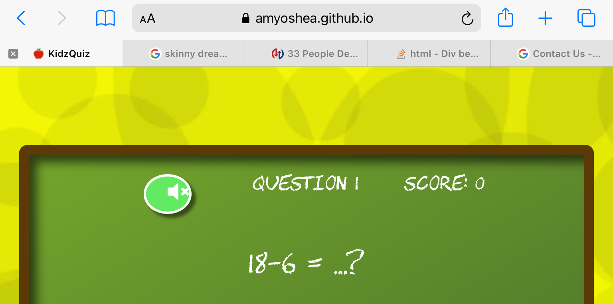

# Full Testing
## Contents
+ [Testing From User Stories](#testing-from-user-stories)
+ [Manually Testing Functionality](#manually-testing-functionality)
+ [Bugs and Fixes](#bugs-and-fixes)
+ [Known Bugs](#known-bugs)
## Testing From User Stories
I tested the user stories on all devices.
### As a child user: 
#### I want to be able to easily navigate through the site.
+ All pages (including 404 error page) have navigation links that can redirect to home.
+ All pages (including 404 error page) have navigation links that can redirect to game play.
+ All pages except the game page can access the rules page(theoretically the user has already read the rules BEFORE playing). 
+ All pages except the game page and error page can access the high scores page. 

  
#### I want to choose if I want sound to play. 
+ Audio only applies to game play so a button has been added to turn audio on/off.
+ Audio is pre-set to off unless user chooses otherwise. 

  
#### I want to be able to see my score as the game progresses.
+ Every time the user chooses a correct answer, the score counter in the heads up display will update to show this.
+ If the user chooses an incorrect answer, the score counter won't update but the previous score will remain. 

 
#### I want to know how many questions I have already answered during the game. 
+ The question number will continue to update after a question is answered, regardless of the user getting the answer right or wrong.

  
#### I want to compare my scores to other users. 
+ All scores that are high enough to make the top 5 are added to the scores table.
+ Scores are all displayed from highest to lowest, regardless of when they are added.
+ At the moment, the scores are held in local storage so as long as the user is playing on the same device as another user, they can see each others saved scores (this has been noted in possible future features). 


#### I want to easily replay the game once I have completed a game. 
+ From both the end game page and high scores page there is a button with the option to replay the game.
+ Because the game html will reload when the replay button is hit, the game will pull another 10 random questions. 

  
#### I want to be able to come back to the game after a period of time and still access my old scores. 
+ Because the scores are saved in the local storage, the user will be able to shut down the page or turn off the device and still be able to go back and view the scores. 
+ The previously saved scores are accessible from the home page. 
+ If the user plays the game again, the previous scores will be shown when they submit their name/new score.

  
### As a parent: 
#### I want my child to be able to test their knowledge.
+ All of the questions are displayed and the answers are multiple choice, giving the user a 1/3 chance to get the answer correct. This should allow the user (presumably a child) to use deductive reasoning if they're not 100% sure what the answer is. 

  
#### I want the site to be easy to navigate through so that my child does not require assistance with the UI.
+ All of the buttons are large enough to be easily accessed. 
+ There's a clean layout with little distraction to avoid any confusion on the users side. 

  
#### I want a variety of subjects covered so that I can identify any gaps in my child's knowledge.
+ At the moment there are 6 categories of questions - Science, General Knowledge, English, Animals, Geography and Maths. 
+ The game is set up to shuffle through the available questions so that there will be a variety available.  

 
---
## Manually Testing Functionality
### Navigation Buttons
+ Went to each page individually and clicked each button to make sure that they navigate to the correct place.
+ Went to each page individually on desktop and hovered over each button to make sure that the ```:hover``` class is applied to all.
+ Went to each page individually on mobile and made sure ```:hover``` isn't applied.
### Game Loader
+ Used Chrome Developers Network tab and set Throttling to 'Slow 3G' to make sure that in the case of slow response, the loader would appear while waiting on questions to populate. 
### Sound Toggle
+ Changed the toggle to on/off several times in one game to check for any issues, checking for both right and wrong answers. 
### Questions
+ Played several games to make sure that all questions were populating correctly. 
### Answer Buttons
+ Played several games to make sure that all answers were populating correctly inside their buttons. 
+ Played several games to make sure that all answers were populating for the correct question.
+ Chose both right and wrong answers to make sure that correct classes were being added to selection. 
+ Chose both right and wrong answers to make sure that correct audio was being played to selection. 
### Heads Up Display
+ Made sure that if the right answer is chosen, the score increments. 
+ Made sure that if the wrong answer is chosen, the score doesn't increment. 
+ Made sure that, regardless of right or wrong answer being chosen, the question number increments. 
### Submit Score
+ Tried to submit score without adding any text to the input field to ensure ```disabled``` function was working when field is left empty. 
+ Added name to input field and submitted to check submit was working. 
### Saved Scores
+ Checked to make sure name and score were populating the table in the correct format.
+ Made sure that correct name and score were being added. 
+ Checked that scores were being added from highest to lowest. 
+ Checked that there is a maximum of 5 scores added to the saved scores table.
+ Made sure that low scores are not added to the table if they fall below previously saved scores. 
+ Shut down device and restarted to make ensure that scores were being saved in local storage. 
### 404 Error Page
+ Manually typed in a html page that didn't exist in the game to check redirect to error page. 
---
## Bugs and Fixes
### 1. ES6 Issue
After the first run through the JS Validator, I received the following error: 



After a bit of research I learned that if you declare that you're using ES6 at the top of your JavaScript file, this error will be removed. I added the following line at the top of my JavaScript file: 


---
### 2. Separate HTML & Single JavaScript

Initially I wanted the JavaScript to all be on one page. However, because there were separate HTML pages that were being used, there were elements that JS was trying to access that didn't exist on certain pages: 


As a result, I separated the JavaScript into separate files.

However, after a bit of research, I learned that I could use an 'if statement' to decide if that element existed and, if not, ignore the JavaScript function. 

---

### 3. After another run through the JS validator, I received the following error: 


I tried a few fixes (including declaring it as a variable on that line) but each fix seemed to cause more problems. As a solution, I added ```saveHighScores``` to my variables section but didn't give it any value: 

  

---
### 4. Hover Button Sticking on Mobile

When I began manually testing on different devices, I notices an issue with the hover class sticking to the buttons that had been previously clicked. This wasn't an issue with desktop, only with mobile. 

 
To counteract this issue, I was able to use the ```@media (pointer: fine)``` feature to add the hover class ONLY to desktop.

However, once that issue was taken care of, a similar one arose. Once a button had been clicked, the text would remain black after a new question and answer choice had been loaded:
 
For this issue, I was able to utilize the ```:focus``` selector to stop the text turning black once that button had been clicked.

---
### 5. iOS Button Distortion

Through manual testing, I saw that the audio toggle button had been distorted through iOS. **This is not an issue that showed up while using inspect element**, it was only caught through manual testing. I also checked this on an Android device but it was only an iOS issue. 

  

I learned that Safari will try to add their own styling to buttons and this would need to be overridden. I added ```-webkit-appearance: none;``` to the button selector and was able to fix the issue. 

---
### 6. Firefox Submit Button

Initially I had used the default 'Submit' on the submit button to add a score to the leaderboard and I was happy to leave it at that. However, after manually testing on different browsers, I saw that the default text in their submit button is different. 
  

I wasn't happy with this so I added ```value="Save"``` to the button in the HTML file and changed the inner test to 'Save'. 

---

## Known Bugs
+ When the user is given the option to input their name to the leaderboard, the auto fill feature is creating a styling issue. When a user manually types their name into the input area, the styling remains consistent with the rest of the page. However, when an auto fill option is clicked, the styling changes (as below):


I've tried to find a fix for this but according to [Mozilla](https://developer.mozilla.org/en-US/docs/Web/CSS/:autofill), there are set stylings that are incredibly difficult to override. I'm happy enough to let this go as, in the grand scheme of the project, it is not a huge deal. 
