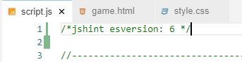

# Full Testing
## Contents
+ [Testing From User Stories](#testing-from-user-stories)
+ [Manual Testing Functionality](#manually-testing-functionality)
+ [Bugs and Fixes](#bugs-and-fixes)
+ [Known Bugs](#known-bugs)

## Testing From User Stories

## Manually Testing Functionality

## Bugs and Fixes

### 1. ES6 Issue
After the first run through the JS Validator, I recieved the following error: 

  

  After a bit of research I learned that if you declare that you're using ES6 at the top of your JavaScript file, this error will be removed. I added the following line at the top of my JavaScript file:  



---
### 2. Seperate HTML & Single JavaScript

Initially I wanted the JavaScript to all be on one page. However, because there were seperate HTML pages that were being used, there were elements that JS was trying to access that didn't exist on certain pages: 


As a result, I seperated the JavaScript into seperate files.

However, after a bit of research, I learned that I could use an 'if statement' to decide if that element existed and, if not, ignore the JavaScript function. 

---

### 3. After another run through the JS validator, I recieved the following error: 


I tried a few fixes (including declaring it as a vairable on that line) but each fix seemed to cause more problems. As a solution, I added saveHighScores to my variables section but didn't give it any value: 

  

---
### 4. Hover Button Sticking on Mobile

When I began manually testing on different devices, I notices an issue with the hover class sticking to the buttons that had been previously clicked. This wasn't an issue with desktop, only with mobile. 

 
To counteract this issue, I was able to use the ```@media (pointer: fine)``` feature to add the hover class ONLY to desktop.

However, once that issue was taken care of, a similar one arose. Once a button had been clicked, the text would remain black after a new question and answer choice had been loaded:
 
For thisissue, I was able to utilize the ```:focus``` selector to stop the text turning black once theat button had been clicked.

---
### 5. iOS Button Distortion

Through manual teseting, I saw that the audio toggle button had been distored through iOS. **This is not an issue that showed up while using inspect element**, it was only caught through manual testing. I also checked this on an Android device but ot was only an iOS issue. 

  

I learned that Safari will try to add their own styling to buttons and this would bneed to be overriden. I added ```-webkit-appearance: none;``` to the button selector and was able to fix the issue. 

---
### 6. Firefox Submit Button

Initially I had used the default 'Submit' on the submit button to add a score to the leaderboard and I was happy to leave it at that. However, after manually testing on different browsers, I saw that the defult text in their submit button is different. 
  

I wasn't happy with this so I added ```value="Save"``` to the button in the HTML file and changed the inner test to 'Save'. 

---

## Known Bugs
+ When the user is given the option to input their name to the leaderboard, the auto fill feature is createing a styling issue. When a user manually types their name into the input area, the styling remains consistant with the rest of the page. However, when an auto fill option is clicked, the styling changes (as below):


I've tried to find a fix for this but according to [Mozilla](https://developer.mozilla.org/en-US/docs/Web/CSS/:autofill), there are set stylings that are incredibly difficult to override. I'm happy enough to let this go as, in the grand scheme of the project, it is not a huge deal. 
